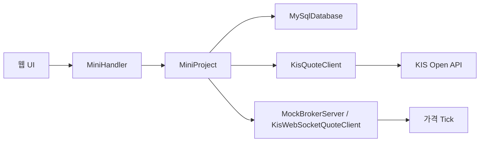
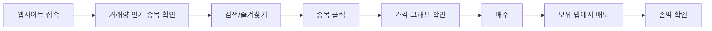

# Java 모의주식투자 발표자료 구성

## 1. 표지

- 제목: Java 프로젝트 모의주식
- 부제: KIS Open API 기반 모의주식투자 웹앱
- 핵심 키워드: Java HttpServer, KIS Open API, MySQL, 소켓, 포트폴리오

## 2. 제안발표 전 vs 최종 구현

| 구분 | 제안발표 단계 | 최종 구현 |
| --- | --- | --- |
| 주제 | Java 미니프로젝트 기능 구현 | 실제 증권 API 기반 모의주식투자 |
| 데이터 | 초기 샘플/내부 데이터 | KIS 현재가, 등락률, 누적 거래량 |
| 저장 | 메모리 중심 구상 | MySQL 테이블 저장 |
| 화면 | 기본 목록과 입력 화면 | 종목 상세, 그래프, 포트폴리오 |
| 흐름 | 드롭다운 선택 후 주문 | 종목 클릭 후 상세 확인과 매매 |

## 3. 프로젝트 목적

- 실제 시세와 거래량을 이용한 모의투자 화면 구현
- 사용자가 종목을 먼저 확인하고 매수/매도하는 흐름 구현
- 보유 종목의 평가금액, 손익, 수익률 자동 계산
- 뉴스 API는 키 관리 부담과 기사 품질 편차 때문에 최종 버전에서 제외

## 4. 전체 시스템 구조

## 5. 코드 구조

| 파일 | 역할 |
| --- | --- |
| `MiniProjectApp.java` | 서버 시작, KIS/DB/소켓 초기화 |
| `MiniHandler.java` | HTTP 요청 라우팅과 JSON 응답 |
| `MiniProject.java` | 회원, 매매, 포트폴리오, 시세 상태 관리 |
| `repository/MySqlDatabase.java` | MySQL 연결과 저장/로드 |
| `external/KisQuotePoller.java` | KIS 토큰, 거래량 순위, 현재가 조회 |
| `external/MockBrokerServer.java` | 소켓 기반 가격 Tick 구독 구조 |
| `view/MiniDashboardPage.java` | HTML/CSS/JavaScript 화면 렌더링 |

## 6. 클래스/인터페이스 설계

- `CompanyProfile`: 회사명과 업종을 가진 공통 추상 클래스
- 종목별 `CompanyProfile` 구현 클래스: 회사 설명 구조 분리
- `StockCategoryProfile`: 업종명과 위험 설명을 제공하는 인터페이스
- 업종·테마별 Category 클래스: 100개 이상 타입 조건을 의미 있는 방식으로 충족

## 7. AI vs 나의 역할

| 구분 | 내가 주도한 부분 | AI 활용 |
| --- | --- | --- |
| 주제 | 모의주식투자 웹사이트 방향 결정 | 구현 방식 후보 정리 |
| 요구사항 | KIS API, 거래량 상위, 그래프, 즐겨찾기 요구 | Java 코드 작성 보조 |
| UI | 종목 클릭 중심 흐름 요구 | HTML/CSS/JS 구현 보조 |
| 문제해결 | 가격 이상, 저장 방식, 서버 실행 문제 지적 | 원인 분석과 수정 보조 |

## 8. 사용자 시나리오

## 9. UI 화면 구성

- 상단 요약: 현금, 평가액, 총자산, 손익, 수익률
- 시장 시세: 거래량 상위 종목, 검색, 즐겨찾기, 10개 단위 페이지
- 종목 상세: 현재가, 등락률, 거래량, 회사 설명, 가격 변화 그래프
- 매매 영역: 선택 종목 매수, 보유 종목 매도
- 보유/즐겨찾기/기록 탭

## 10. 데이터 흐름

- 입력: 종목 선택, 즐겨찾기, 매수/매도 수량
- 외부 입력: KIS 현재가, 등락률, 누적 거래량
- 처리: 잔액 확인, 보유 수량 확인, 매매 체결, 손익 계산
- 저장: MySQL `members`, `shares`, `trade_logs`
- 출력: 시장 시세, 종목 상세, 그래프, 포트폴리오, 거래 기록

## 11. 데이터 처리 방식

| 데이터 | 처리 방식 |
| --- | --- |
| 주식 시세 | KIS 현재가 REST API |
| 종목 선별 | 거래량 기준 상위 종목 |
| 실시간성 | 상위 목록 중심 갱신 + 소켓 구독 구조 실험 |
| 사용자 데이터 | MySQL 테이블 저장 |
| 가격 그래프 | 서버가 보관한 최근 가격 히스토리 |

## 12. 시행착오

- 서버 재시작 시 데이터가 사라지는 문제를 MySQL 저장 구조로 변경
- 한글 UI가 깨지지 않도록 UTF-8 기준 정리
- KIS API 키를 환경변수로 분리
- 전체 2700개 종목을 계속 갱신하는 대신 거래량 상위 종목으로 제한
- 뉴스 기능은 외부 키 관리와 기사 품질 편차 때문에 최종 버전에서 제외
- UI는 종목 클릭, 검색, 즐겨찾기, 상세 매매 흐름 중심으로 단순화

## 13. Java 클래스 활용

- `HttpServer`: 웹 서버
- `HttpClient`: KIS API 호출
- `Thread`: 백그라운드 시세 갱신
- `ConcurrentHashMap`: 회원/종목 상태 관리
- `ArrayList`, `LinkedHashMap`, `List`: 거래 기록, 가격 히스토리, 조회 순서 관리
- `JDBC DriverManager`: MySQL 연결
- `LocalDateTime`: 거래 시간과 시세 갱신 시각

## 14. Java 클래스 활용

- `HttpServer`: 웹 서버
- `HttpClient`: KIS API 호출
- `Thread`: 백그라운드 시세 갱신
- `ConcurrentHashMap`: 회원/종목 상태 관리
- `ArrayList`, `LinkedHashMap`, `List`: 거래 기록, 가격 히스토리, 조회 순서 관리
- `JDBC DriverManager`: MySQL 연결
- `LocalDateTime`: 거래 시간과 시세 갱신 시각

## 15. 주요 코드 흐름

- 브라우저 요청: `GET /api/state`, `POST /api/stock/buy`, `POST /api/stock/sell`
- `MiniHandler`: URL을 확인하고 `MiniProject` 메서드 호출
- `MiniProject`: 잔액 확인, 수량 확인, 보유 주식 갱신, 거래 기록 추가
- 저장소: MySQL 테이블에 계좌, 보유 종목, 거래 기록 저장
- 발표에서는 긴 코드보다 요청, 처리, 저장이 연결되는 흐름을 중심으로 설명

## 16. 보완 상태와 남은 과제

- 구현 완료: 로그인 제거, 단일 모의 계좌, 패키지 물리 분리, README/PPT/보고서 용어 정합성 정리
- 보완 완료: KIS WebSocket 오류 시 REST 폴링 전환
- 남은 검증: 실제 KIS 테스트베드에서 WebSocket 구독 성공 여부와 메시지 필드 순서 확인
- 향후 개선: 업종별 위험 등급 UI, 개인화 관심종목 추천, 테스트 코드 보강

## 17. 시연 영상

- `0~4초`: 웹사이트 접속과 상단 요약
- `4~8초`: 시장 시세와 검색
- `8~12초`: 종목 상세와 가격 그래프
- `12~16초`: 매수 후 보유 탭에서 손익 확인
- 영상 파일: `deliverables/mock-stock-website-demo.webm`
