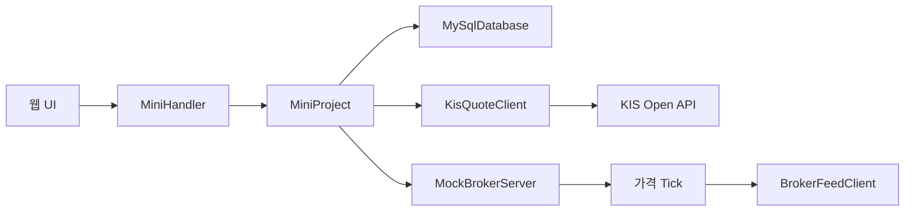
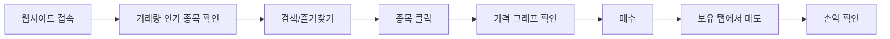

# Java 모의주식투자 발표자료 구성

## 1. 표지

- 제목: Java 프로젝트 모의주식
- 부제: KIS Open API 기반 모의주식투자 웹앱
- 핵심 키워드: Java HttpServer, KIS Open API, MySQL, 소켓, 포트폴리오

## 2. 발표 흐름

- 왜 만들었는가
- 제안 단계와 최종 구현이 어떻게 달라졌는가
- 사용자는 어떻게 쓰는가
- 데이터와 Java 코드는 어떻게 흐르는가
- 시행착오와 남은 과제는 무엇인가

## 3. 제안 단계 vs 최종 구현

| 구분 | 제안 단계 | 최종 구현 |
| --- | --- | --- |
| 주제 | Java 미니프로젝트 기능 구현 | KIS API 기반 모의주식투자 웹앱 |
| 가격 데이터 | 내부 샘플/모의 가격 | 한국투자증권 KIS 현재가와 거래량 |
| 저장 | 메모리 중심 구상 | MySQL 테이블 필수 저장 |
| 화면 | 기본 목록과 입력 화면 | 종목 상세, 그래프, 포트폴리오 |
| 매매 흐름 | 드롭다운 선택 후 주문 | 종목 클릭 후 상세 확인과 매매 |

## 4. 프로젝트 목적

- 실제 시세와 거래량을 이용한 모의투자 화면 구현
- 사용자가 종목을 먼저 확인하고 매수/매도하는 흐름 구현
- 보유 종목의 평가금액, 손익, 수익률 자동 계산
- 뉴스 API는 키 관리 부담과 기사 품질 편차 때문에 최종 버전에서 제외

## 5. 전체 시스템 구조

## 6. 코드 구조 + 주요 코드 흐름

| 묶음 | 주요 파일 | 역할 |
| --- | --- | --- |
| 실행/요청 | `MiniProjectApp`, `MiniHandler` | 서버 시작과 API 라우팅 |
| 핵심 로직 | `MiniProject` | 모의 계좌, 매매, 포트폴리오, 시세 상태 관리 |
| 저장소 | `ProjectDatabase`, `MySqlDatabase` | MySQL 필수 저장과 데이터 로드/저장 |
| 외부 시세 | `KisQuoteClient`, `KisQuotePoller`, `KisWebSocketQuoteClient`, `MockBrokerServer` | KIS REST/WebSocket 시세와 모의 소켓 Tick |
| 화면/도메인 | `MiniDashboardPage`, `Member`, `Stock`, `Share`, `TradeLog`, `StockCategories` | 웹 UI와 종목/거래 데이터 모델 |

주요 코드 흐름:

- `MiniHandler`: `/api/state`, `/api/stock/buy`, `/api/stock/sell` 요청을 라우팅
- `MiniProject`: 잔액 확인, 보유 수량 확인, 거래 기록 추가, 포트폴리오 계산
- `MySqlDatabase`: 계좌, 보유 주식, 거래 기록을 MySQL에 저장

## 7. 클래스/인터페이스 설계

- `CompanyProfile`: 회사명과 업종을 가진 공통 추상 클래스
- 종목별 `CompanyProfile` 구현 클래스: 회사 설명 구조 분리
- `StockCategoryProfile`: 업종명과 위험 설명을 제공하는 인터페이스
- 업종·테마별 Category 클래스: 100개 이상 타입 조건을 의미 있는 방식으로 충족
- class / interface / enum 합계 111개

## 8. Java 클래스/라이브러리 활용

| 구분 | 활용한 Java 클래스/라이브러리 | 프로젝트에서 맡은 역할 |
| --- | --- | --- |
| 웹 서버 | `HttpServer`, `HttpExchange`, `Executors` | 브라우저 요청 수신, API 응답, 서버 스레드 관리 |
| 외부 API | `HttpClient`, `HttpRequest`, `WebSocket` | KIS 현재가 조회와 WebSocket 구독 시도 |
| 상태 관리 | `ConcurrentHashMap`, `ArrayList`, `LinkedHashMap` | 종목 상태, 거래 기록, 가격 히스토리 저장 |
| DB 저장 | `JDBC DriverManager`, `PreparedStatement`, `ResultSet` | MySQL 연결, 계좌/보유/거래 기록 저장 |
| 시간/출력 | `LocalDateTime`, `DateTimeFormatter`, `StringBuilder` | 거래 시간 표시와 HTML/JSON 문자열 생성 |

## 9. AI vs 나의 역할

| 구분 | 내가 주도한 부분 | AI 활용 |
| --- | --- | --- |
| 주제 | 모의주식투자 웹사이트 방향 결정 | 구현 방식 후보 정리 |
| 요구사항 | KIS API, 거래량 상위, 그래프/즐겨찾기 요구 | Java 코드 작성 보조 |
| UI | 종목 클릭 중심 흐름 요구 | HTML/CSS/JS 구현 보조 |
| 문제해결 | 가격 이상, 저장 방식, 서버 실행 문제 지적 | 원인 분석과 수정 보조 |

## 10. 사용자 시나리오

## 11. UI 화면 구성

- 상단 요약: 현금, 평가액, 총자산, 손익, 수익률
- 시장 시세: 거래량 상위 종목, 검색, 즐겨찾기, 10개 단위 페이지
- 종목 상세: 현재가, 등락률, 거래량, 회사 설명, 가격 변화 그래프
- 매매 영역: 선택 종목 매수, 보유 종목 매도
- 보유/즐겨찾기/기록 탭

## 12. 데이터 흐름

- 입력: 종목 선택, 즐겨찾기, 매수/매도 수량
- 외부 입력: KIS 현재가, 등락률, 누적 거래량
- 처리: 잔액 확인, 보유 수량 확인, 매매 체결, 손익 계산
- 저장: MySQL `members`, `shares`, `trade_logs`
- 출력: 시장 시세, 종목 상세, 그래프, 포트폴리오, 거래 기록

## 13. 데이터 처리 방식

| 데이터 | 처리 방식 |
| --- | --- |
| 주식 시세 | KIS 현재가 REST API 조회 |
| 종목 선별 | 거래량 기준 상위 종목 |
| 실시간성 | 상위 목록 중심 갱신 + 소켓 구독 구조 실험 |
| 사용자 데이터 | MySQL 테이블 저장 |
| 가격 그래프 | 서버가 보관한 최근 가격 히스토리 |

## 14. 시행착오

- 실제 시세 연동 문제
- 전체 종목 처리 범위 결정
- UI 흐름 개선
- 뉴스 기능 제거 판단
- DB 저장 전환

## 15. 보완 상태와 남은 과제

- 구현 완료: 로그인 제거, 단일 모의 계좌, 패키지 물리 분리
- 보완 완료: KIS WebSocket 오류 시 REST 폴링 전환
- 남은 검증: 실제 KIS 테스트베드에서 WebSocket 구독 성공 여부와 메시지 필드 순서 확인
- 향후 개선: 테스트 코드 보강, 서비스 세분화, WebSocket 실환경 검증 결과 문서화

## 16. 시연 영상

- `0~8초`: 웹사이트 접속과 시장 시세
- `8~17초`: 종목코드 `009150` 검색
- `17~30초`: 삼성전기 종목 상세와 가격 그래프
- `30~44초`: 매수 후 보유 탭에서 손익 확인
- 영상 파일: `deliverables/mock-stock-website-demo.webm`
