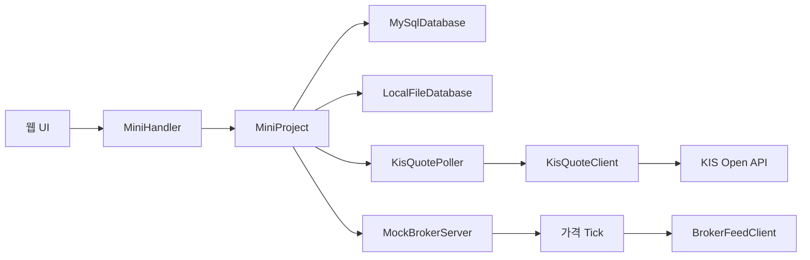

# Java 모의주식투자 발표자료 구성

이 문서는 최종 발표 PPT `찐 자바 프젝 최종본.pptx`의 15장 구성에 맞춘 GitHub용 설명이다. 별도 순서 안내장과 요약 전용 장표는 제외하고, 실제 구현 구조와 주요 코드 설명을 앞쪽에 배치했다.

## 1. 표지

- 제목: Java 프로젝트 모의주식
- 부제: KIS Open API 기반 모의주식투자 웹앱
- 핵심 키워드: Java HttpServer, KIS Open API, MySQL, 모의투자, 포트폴리오

## 2. 제안 단계 vs 최종 구현

| 구분 | 제안 단계 | 최종 구현 |
| --- | --- | --- |
| 주제 | Java 미니프로젝트 기능 구현 | KIS API 기반 모의주식투자 웹앱 |
| 가격 데이터 | 내부 샘플/모의 가격 | 한국투자증권 KIS 현재가와 거래량 |
| 저장 | 메모리 중심 구상 | MySQL 우선 + TSV fallback |
| 화면 | 기본 목록과 입력 화면 | 종목 상세, 그래프, 포트폴리오 |
| 매매 흐름 | 드롭다운 선택 후 주문 | 종목 클릭 후 상세 확인과 매매 |

## 3. 전체 시스템 구조



브라우저는 `/api/state`를 주기적으로 호출하고, 서버는 백그라운드 Thread에서 시세와 포트폴리오 상태를 갱신한다.

## 4. 패키지 구조 다이어그램

| 패키지 | 주요 클래스 | 역할 |
| --- | --- | --- |
| `app` | `MiniProjectApp` | 서버 시작, 포트 설정 |
| `controller` | `MiniHandler` | HTTP 라우팅 |
| `service` | `MiniProject` | 매매, 포트폴리오, 시세 상태 |
| `repository` | `MySqlDatabase`, `LocalFileDatabase` | 계좌·보유·거래 저장 |
| `external` | `KisQuoteClient`, `KisQuotePoller` | KIS 현재가·거래량 조회 |
| `view` | `MiniDashboardPage` | HTML/CSS/JS 생성 |
| `domain` | `Member`, `Stock`, `Share`, `TradeLog` | 핵심 데이터 모델 |
| `util` | `Json` | API 응답 생성과 body 파싱 |

요청 흐름은 `Browser -> controller -> service -> repository/external -> JSON 응답 -> view 갱신` 순서로 설명한다.

## 5. 클래스/라이브러리 구조 상세

| 계층 | 주요 클래스 | Java 기능 | 역할 |
| --- | --- | --- | --- |
| 실행/서버 | `MiniProjectApp`, `MiniHandler` | `HttpServer`, `HttpExchange` | 웹 서버 시작과 API 라우팅 |
| 서비스 | `MiniProject` | `ConcurrentHashMap`, `ArrayList` | 매수/매도, 포트폴리오, 시세 상태 |
| 저장소 | `MySqlDatabase`, `LocalFileDatabase` | JDBC, `Files`, `Path` | MySQL 우선 + TSV fallback |
| 외부 API | `KisQuoteClient`, `KisQuotePoller` | `HttpClient`, `Thread` | KIS 현재가와 거래량 순위 갱신 |
| 화면 | `MiniDashboardPage` | 문자열 템플릿, JavaScript | 검색, 즐겨찾기, 그래프, 주문 UI |

클래스와 인터페이스는 112개이며, 회사 설명과 업종 분류를 위한 추상 클래스/인터페이스 구조를 포함한다.

## 6. 주요 코드 흐름

### 매수 처리

```java
int total = stock.price * quantity;
if (member.balance < total) return error;
member.balance -= total;
member.shares.compute(stockName, (key, share) ->
    share == null ? new Share(stockName, quantity, stock.price)
                  : share.buy(quantity, total));
logs.add(new TradeLog(member.uid, stockName, quantity, total, "BUY"));
saveDatabase();
```

### KIS 현재가 조회

```java
GET /uapi/domestic-stock/v1/quotations/inquire-price
tr_id: FHKST01010100
price = output.stck_prpr
change = output.prdy_vrss
volume = output.acml_vol
```

### 저장소 선택

```java
try {
    database = MySqlDatabase.fromEnv();
    snapshot = database.load(marketStocks);
} catch (Exception ex) {
    database = LocalFileDatabase.defaultPath();
    snapshot = database.load(marketStocks);
}
```

## 7. 데이터 흐름

| 단계 | 내용 |
| --- | --- |
| 입력 | 종목 선택, 즐겨찾기, 매수/매도 수량 |
| 외부 입력 | KIS 현재가, 등락률, 거래량 |
| 처리 | 잔액 확인, 보유 수량 확인, 매매 체결, 손익 계산 |
| 저장 | `members`, `shares`, `trade_logs` |
| 출력 | 시장 시세, 종목 상세, 그래프, 포트폴리오, 거래 기록 |

## 8. DB 저장 구조

| 테이블 | 주요 컬럼 | 저장 내용 |
| --- | --- | --- |
| `members` | `uid`, `name`, `balance` | 단일 모의 계좌와 현재 현금 잔액 |
| `shares` | `member_uid`, `stock_name`, `quantity`, `purchase_price` | 보유 종목, 수량, 총 매입금액 |
| `trade_logs` | `id`, `member_uid`, `stock_name`, `quantity`, `price`, `trade_type`, `traded_at` | 매수/매도 기록과 거래 시각 |

평균단가는 DB에 따로 저장하지 않고 `purchase_price / quantity`로 계산한다. MySQL 연결에 실패하면 같은 데이터를 `data/local-database.tsv`에 저장한다.

## 9. 사용자 시나리오와 Use Case

1. 웹사이트 접속
2. 거래량 인기 종목 확인
3. 검색/즐겨찾기
4. 종목 클릭
5. 가격 그래프 확인
6. 매수
7. 보유 탭에서 매도
8. 손익 확인

처음에는 목록에서 아무 종목이나 고르는 방식이었지만, 최종 UI는 실제 투자 앱처럼 종목을 먼저 확인하고 판단한 뒤 주문하는 흐름이다.

## 10. 실행 화면과 UI 캡처

PPT에는 다음 화면 캡처를 배치한다.

- 시장 시세: 거래량 상위 종목을 10개 단위 페이지로 확인
- 검색/즐겨찾기: 종목코드 검색과 별표 기반 관심종목 등록
- 종목 상세/주문: 현재가, 등락률, 그래프 확인 후 매수
- 포트폴리오: 보유 종목, 평가금액, 손익률, 매도 흐름

## 11. 실제 시세 연동 여부 확인

`/api/state` 응답에서 현재 시세 출처를 확인할 수 있다.

```json
"broker": {
  "source": "한국투자증권 KIS REST API",
  "protocol": "KIS REST API"
},
"quoteSource": "한국투자증권 KIS"
```

| 상황 | 동작 | 발표 때 설명 |
| --- | --- | --- |
| KIS 환경변수 있음 | KIS REST API 현재가 사용 | 표시 가격은 현재가 API의 `stck_prpr` 값 |
| KIS 환경변수 없음 | 내장 모의 증권사 소켓 사용 | API 키 없이도 화면 시연 가능 |
| KIS 호출 일부 실패 | REST 폴링 유지 | KIS 출처 종목은 모의 Tick이 덮지 않음 |

## 12. 환경 변수 설정과 실행 방법

| 구분 | 환경변수 | 역할 |
| --- | --- | --- |
| KIS REST | `KIS_APP_KEY`, `KIS_APP_SECRET`, `KIS_BASE_URL` | 한국투자증권 현재가·거래량 조회 |
| 갱신 범위 | `KIS_MARKET_LIMIT`, `KIS_POLL_LIMIT` | 거래량 순위 조회와 현재가 폴링 대상 수 조절 |
| MySQL | `MYSQL_URL`, `MYSQL_USER`, `MYSQL_PASSWORD` | 모의 계좌, 보유 종목, 거래 기록 저장 |
| WebSocket | `KIS_USE_WEBSOCKET`, `KIS_WS_URL` | 실시간 체결 구독 시도 후 실패 시 REST 전환 |

```powershell
$env:KIS_APP_KEY="발급받은_APP_KEY"
$env:KIS_APP_SECRET="발급받은_APP_SECRET"
$env:MYSQL_URL="jdbc:mysql://localhost:3306/mock_stock"
$env:MYSQL_USER="root"
java -cp "out;lib/*" app.MiniProjectApp 8080
```

MySQL은 먼저 시도하고, 환경변수 누락 또는 연결 실패 시 `data/local-database.tsv`로 전환한다. KIS 키가 없을 때 시세는 내장 모의 증권사 소켓으로 전환된다.

## 13. 한 달간 시행착오

| 항목 | 정리 |
| --- | --- |
| 실제 시세 연동 | KIS REST 호출 실패 뒤 내장 모의 시세가 가격을 덮는 문제를 수정 |
| 전체 종목 처리 범위 | 약 2700개 전체 종목 대신 거래량 상위 종목 중심으로 제한 |
| UI 흐름 개선 | 드롭다운 주문 대신 종목 클릭 -> 상세 확인 -> 매수, 보유 종목 -> 매도 흐름으로 변경 |
| 뉴스 기능 제거 | 기사 품질 편차와 API 키 관리 부담 때문에 최종 제외 |
| DB 저장 전환 | 서버 재시작 시 기록이 사라지는 문제를 MySQL 우선 저장과 TSV fallback으로 보완 |

## 14. 향후 개선 로드맵

| 개선 항목 | 구체 계획 | 예상 효과 |
| --- | --- | --- |
| WebSocket 실계정 검증 | KIS 테스트베드에서 구독 성공, 실패 코드, 메시지 필드 순서 확인 | REST 폴링보다 자연스러운 체결가 갱신 |
| 서비스 계층 세분화 | `MiniProject`를 `TradingService`, `PortfolioService`, `MarketService`로 분리 | 유지보수성과 기능 추가 편의 향상 |
| 테스트 코드 보강 | 매수/매도, DB 저장, API 파싱 단위 테스트 작성 | 수정 후 회귀 오류 확인 |
| 업종 위험 표시 | `StockCategories` 값을 UI 배지로 표시 | 종목 선택 시 투자 판단 정보 보강 |
| 개인화 관심종목 | 즐겨찾기와 거래 기록 기반 추천 기준 설계 | 사용자 중심 화면으로 확장 |

## 15. 시연 영상 구성

| 구간 | 보여줄 화면 | 말할 내용 |
| --- | --- | --- |
| 0~8초 | 웹사이트 접속과 시장 시세 | 상단 자산 요약과 거래량 상위 종목 확인 |
| 8~16초 | 종목코드 검색 | 검색창에 `005930`을 입력해 삼성전자 조회 |
| 16~25초 | 상세 화면과 주문 | 현재가, 그래프, 즐겨찾기, 1주 매수 |
| 25~35초 | 보유/기록/매도 | 보유 탭 확인, 기록 탭 이동, 매도 후 시장 페이지 확인 |

영상 파일 위치:

```text
deliverables/mock-stock-website-demo.webm
```
