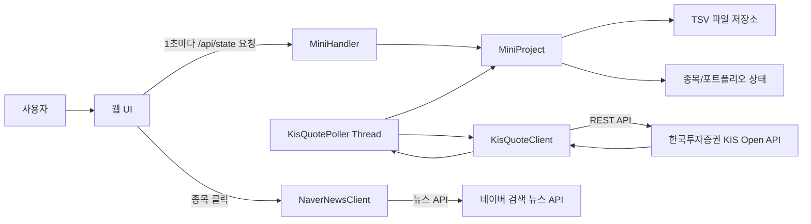
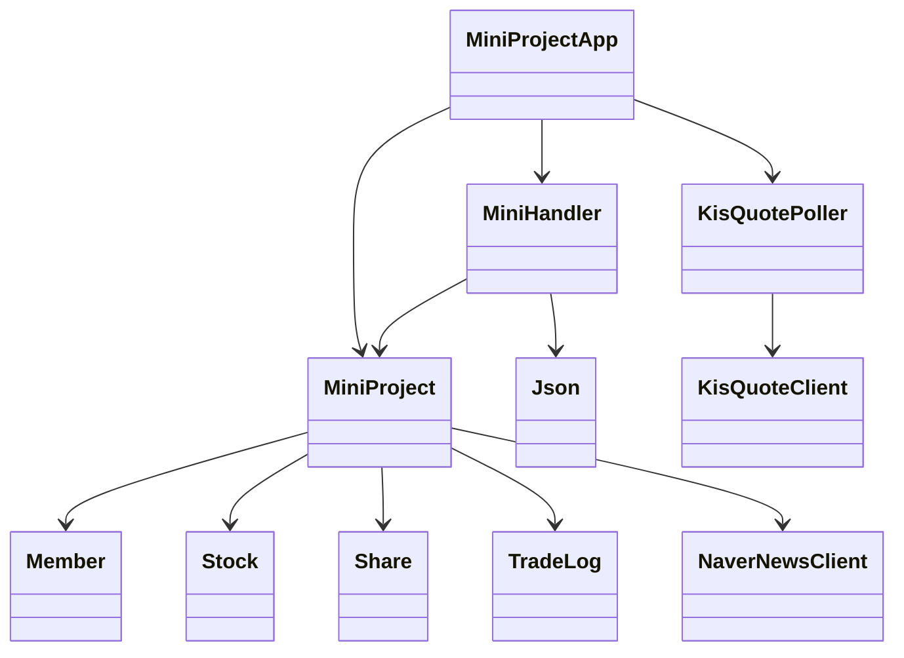
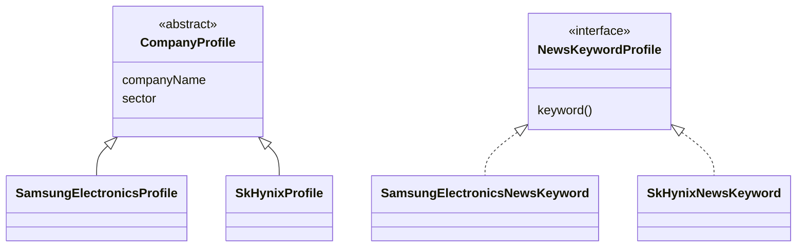
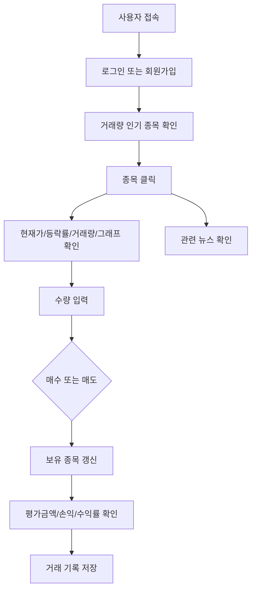

# Java 모의주식투자 웹앱 발표 자료 구성안

## 1. 제목

- 프로젝트명: Java 프로젝트 모의주식
- 주제: 한국투자증권 KIS Open API 기반 모의주식투자 웹앱
- 핵심 목표: 실제 증권 시세를 활용해 매수/매도, 포트폴리오 손익, 거래량 기반 인기 종목, 뉴스 정보를 제공하는 Java 웹 프로젝트 구현

발표 멘트:
이 프로젝트는 단순 랜덤 가격을 보여주는 모의투자 앱이 아니라, 한국투자증권 KIS Open API에서 국내주식 현재가와 거래량을 받아와 사용자가 실제 시세 기반으로 모의투자를 연습할 수 있도록 만든 Java 웹앱입니다.

## 2. 주제 변화: 제안발표 전 vs 후

| 구분 | 제안발표 단계 | 최종 구현 |
| --- | --- | --- |
| 주제 | Java 미니프로젝트 기능 구현 중심 | 실제 증권 API 기반 모의주식투자 웹앱 |
| 데이터 | 초기 샘플/내부 데이터 중심 | KIS Open API 현재가, 등락률, 누적 거래량 |
| 화면 | 기본 매매/목록 화면 | 종목 상세, 가격 추이 그래프, 뉴스, 포트폴리오 손익 |
| 저장 | 메모리 중심 구상 | TSV 파일 저장으로 회원/보유/거래 기록 유지 |
| 목적 | 과제 조건 충족 | 실제 투자 흐름을 연습할 수 있는 모의투자 시스템 |

## 3. 프로젝트 목적

- 실제 주식 데이터를 사용해 모의투자 경험을 제공한다.
- 사용자가 종목을 확인하고 매수/매도하면서 자산 변화를 확인한다.
- 거래량이 많은 인기 종목 순으로 시장 시세를 보여준다.
- 종목별 뉴스와 가격 추이 그래프를 함께 보여준다.
- Java 표준 라이브러리만으로 HTTP 서버, API 연동, 파일 저장, 쓰레드 처리를 구현한다.

## 4. 전체 시스템 구조

## 5. 코드 구조

| 파일 | 역할 |
| --- | --- |
| `MiniProjectApp.java` | 서버 시작, KIS Poller 시작 |
| `MiniHandler.java` | HTTP 요청 라우팅 |
| `MiniProject.java` | 회원, 매매, 포트폴리오, DB 저장 핵심 로직 |
| `DomainModels.java` | Member, Stock, Share, TradeLog 등 도메인 모델 |
| `KisIntegration.java` | KIS 토큰 발급, 현재가 조회, 시세 폴링 |
| `NewsIntegration.java` | 네이버 뉴스 조회와 뉴스 영향 태그 |
| `WebPages.java` | HTML/CSS/JavaScript 화면 렌더링 |
| `Json.java` | JSON 응답 생성과 요청 파싱 |

## 6. 클래스/인터페이스 설계

## 7. 상속과 인터페이스

설계 이유:
- `CompanyProfile`은 회사명과 업종을 공통으로 다루기 위해 추상 클래스로 설계했다.
- `NewsKeywordProfile`은 종목별 뉴스 검색어를 같은 규칙으로 제공하기 위해 인터페이스로 분리했다.
- 100개 이상 타입 조건을 충족하면서도 회사/뉴스 키워드 구조를 명확히 보여줄 수 있다.

## 8. AI vs 나의 역할

| 구분 | 내가 주도한 부분 | AI를 활용한 부분 |
| --- | --- | --- |
| 주제 | 모의주식투자 웹사이트 방향 결정 | 기능 구현 방식 후보 정리 |
| 요구사항 | KIS API, 100개 종목, 거래량 정렬, 뉴스/그래프 요청 | Java 코드 작성 보조, 오류 원인 분석 |
| UI | 불필요한 기능 삭제, 종목 상세 중심 화면 요구 | HTML/CSS/JS 구조 구현 |
| 문제해결 | 잘못 보이는 가격 지적, README 문구 수정 요구 | KIS 응답 확인, 폴링 순서 개선, 문서 정리 |
| 최종 검증 | 직접 실행 화면 확인 | 컴파일, API 상태 확인, GitHub 정리 |

## 9. 사용자 시나리오와 Use Case

## 10. 데이터 흐름

- 입력: 사용자 로그인, 종목 선택, 매수/매도 수량, 게시글/댓글 입력
- 외부 데이터: KIS 현재가, 전일대비, 등락률, 누적 거래량
- 처리: 포트폴리오 평가액 계산, 손익/수익률 계산, 거래량 순 정렬, 뉴스 키워드 분석
- 저장: 회원 정보, 보유 주식, 거래 기록을 TSV 파일에 저장
- 출력: 웹 화면, 시장 시세 표, 종목 상세, 가격 그래프, 뉴스, 포트폴리오, 거래 기록

## 11. 사용자 UI / 화면

- 상단 요약: 현금, 주식 평가액, 총 자산, 손익, 수익률
- 시장 시세: 국내 주요 종목 100개, 거래량 많은 순 정렬
- 종목 상세: 종목 코드, 업종, 현재가, 변동폭, 변동률, 거래량, 시세 출처, 갱신 시각
- 그래프: 최근 가격 히스토리를 SVG 선 그래프로 표시
- 뉴스: 네이버 뉴스 API 결과와 호재/악재/중립 태그
- 탭: 보유 주식, 거래 기록, 게시판

## 12. 한 달간 시행착오

- 메모리 저장 문제: 서버 재시작 시 데이터가 사라져 TSV 파일 저장으로 변경
- 인코딩 문제: 한글이 깨져 UTF-8 컴파일과 파일 인코딩을 명시
- KIS API 키 문제: 환경변수 설정과 토큰 발급 흐름 정리
- 삼성전자 가격 문제: 초기 데이터가 먼저 보이는 문제를 시세 출처/갱신 시각 표시로 해결
- API 지연 문제: 100개 종목 순차 조회 때문에 주요 종목 우선 조회와 재시도 로직 추가
- UI 복잡도 문제: 운세/예측성 표현 제거, 실제 시세와 종목 상세 중심으로 단순화

## 13. Java 클래스 활용

- `HttpServer`: 웹 서버 구현
- `HttpClient`: KIS API, 네이버 뉴스 API 호출
- `Thread`: KIS 시세 폴링
- `ConcurrentHashMap`: 회원/종목 상태 동시 접근 처리
- `ArrayList`, `List`: 게시글, 거래 기록, 가격 히스토리 관리
- `LinkedHashMap`: KIS 조회 순서와 JSON 응답 순서 유지
- `Path`, `Files`: TSV 파일 저장/로드
- `LocalDateTime`: 거래 시간, 가격 갱신 시각 기록
- `AtomicLong`, `AtomicInteger`: 회원/게시글/댓글 ID 생성

## 14. 데이터 처리 방식

| 데이터 | 처리 방식 |
| --- | --- |
| 주식 시세 | KIS Open API 실시간 현재가 REST 조회 |
| 종목 목록 | 프로젝트 등록 국내 주요 종목 100개 |
| 인기 순위 | KIS 누적 거래량 기준 정렬 |
| 뉴스 | 네이버 검색 뉴스 API |
| 뉴스 영향 | 제목/본문 키워드 기반 호재/악재/중립 분류 |
| 사용자 데이터 | TSV 파일 저장 |
| 가격 그래프 | 서버가 보관한 최근 가격 히스토리 표시 |

## 15. 결론과 발전 방향

결론:
- Java 표준 라이브러리만으로 실제 API 연동형 모의주식 웹앱을 구현했다.
- 단순 더미데이터가 아니라 KIS 현재가와 거래량을 기반으로 화면을 구성했다.
- 파일 저장, 쓰레드, 컬렉션, HTTP 서버/클라이언트, JSON 처리 등 Java 핵심 기능을 폭넓게 활용했다.

발전 방향:
- 지정가 주문 자동 체결
- SQLite 또는 H2 DB 전환
- 최근 N일 차트 데이터 저장
- 변동성 지표를 실제 통계 기반으로 개선
- 종목별 손익 분석과 자산 변화 그래프 추가
