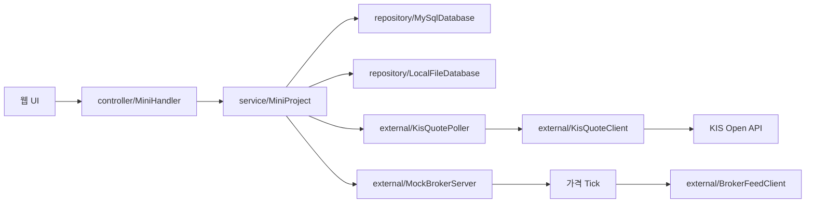

# Java 모의주식투자 웹앱 개인 프로젝트 보고서

## 1. 프로젝트 개요

이 프로젝트는 Java 표준 라이브러리 중심으로 만든 모의주식투자 웹앱이다. 사용자는 별도 로그인 없이 브라우저에서 국내 주식 종목을 확인하고, 종목 상세 화면에서 현재가와 가격 변화 그래프를 본 뒤 매수할 수 있다. 이미 산 종목은 보유 탭에서 수량을 지정해 매도한다.

핵심 목표는 단순 주문 연습이 아니라 실제 시세, 거래량, 가격 그래프, 포트폴리오 손익을 하나의 흐름으로 연결하는 것이다. 한국투자증권 KIS Open API를 이용해 국내주식 현재가와 거래량 정보를 가져오고, 모의 계좌의 보유 주식과 거래 기록은 MySQL을 우선 사용해 저장한다. MySQL 환경변수가 없거나 연결에 실패하면 `LocalFileDatabase`가 `data/local-database.tsv`에 같은 데이터를 저장한다.

뉴스 API 기능은 최종 버전에서 제외했다. 종목별 기사 품질 차이가 크고, 별도 API 키 관리 부담이 있어서 발표와 실행 안정성 측면에서 프로젝트 목적과 맞지 않는다고 판단했다.

## 2. 제안 단계 vs 최종 구현

| 구분 | 제안 단계 | 최종 구현 |
| --- | --- | --- |
| 주제 | Java 미니프로젝트 기능 구현 | KIS API 기반 모의주식투자 웹앱 |
| 가격 데이터 | 내부 샘플/모의 가격 | 한국투자증권 KIS 현재가와 거래량 |
| 저장 | 메모리 중심 구상 | MySQL 우선 저장 + TSV fallback |
| 화면 | 기본 목록과 입력 화면 | 종목 상세, 그래프, 검색, 즐겨찾기, 포트폴리오 |
| 매매 흐름 | 드롭다운에서 종목 선택 후 주문 | 종목 클릭 후 상세 확인과 매수, 보유 탭에서 매도 |
| 목적 | 기능 구현 연습 | 실제 데이터 기반 모의투자 흐름 구현 |

초기에는 기능을 많이 넣는 방향에 가까웠지만, 최종본에서는 모의투자라는 목적에 맞게 실제 시세 조회, 종목 선택, 주문, 보유 손익 확인 흐름을 중심으로 정리했다.

## 3. 전체 시스템 구조



브라우저는 `/api/state`를 주기적으로 호출해 서버 상태를 동기화한다. 서버는 `MiniHandler`에서 HTTP 요청을 받고, `MiniProject`가 매수/매도와 포트폴리오 계산을 처리한다. 시세는 KIS API에서 가져오고, 저장은 MySQL을 먼저 사용한다. MySQL 연결이 불가능한 환경에서는 TSV 파일 저장소로 전환해 과제 시연이 끊기지 않게 했다. 화면에서는 서버 동기화 사이에도 1초 단위 표시용 가격 틱을 만들어 그래프가 멈춰 보이지 않게 했다.

## 4. 패키지와 코드 구조

| 패키지 | 주요 클래스 | 역할 |
| --- | --- | --- |
| `app` | `MiniProjectApp` | 서버 시작, 포트 설정, KIS/DB/시세 갱신 초기화 |
| `controller` | `MiniHandler` | HTTP 라우팅, 요청 body 파싱, JSON 응답 |
| `service` | `MiniProject` | 매매 처리, 포트폴리오 계산, 시세 상태 관리 |
| `domain` | `Member`, `Stock`, `Share`, `TradeLog`, `PricePoint` | 모의 계좌, 종목, 보유 주식, 거래 기록, 가격 이력 모델 |
| `repository` | `ProjectDatabase`, `MySqlDatabase`, `LocalFileDatabase`, `DatabaseSnapshot` | 저장소 인터페이스, MySQL 저장, TSV fallback |
| `external` | `KisQuoteClient`, `KisQuotePoller`, `KisWebSocketQuoteClient`, `MockBrokerServer` | 외부 시세 API, WebSocket 시도, 모의 소켓 서버 |
| `view` | `MiniDashboardPage` | HTML/CSS/JavaScript 화면 생성 |
| `util` | `Json` | JSON 응답 생성과 요청 데이터 파싱 |

현재 `src/main/java` 아래에는 실제 Java 패키지가 분리되어 있다. 전체 클래스/인터페이스/enum 수는 112개이며, 단순히 수만 늘린 것이 아니라 회사 설명, 업종 분류, 저장소, 외부 API, 소켓 구조를 나눠 역할을 분리했다.

## 5. 클래스/라이브러리 구조 상세

| 계층 | 주요 클래스 | 사용한 Java 기능 | 맡은 역할 |
| --- | --- | --- | --- |
| 실행/서버 | `MiniProjectApp`, `MiniHandler` | `HttpServer`, `HttpExchange`, `Executors` | 웹 서버 시작, API 라우팅 |
| 서비스 | `MiniProject` | `ConcurrentHashMap`, `ArrayList`, `Comparator` | 매수/매도, 포트폴리오, 시세 상태 |
| 도메인 | `Member`, `Stock`, `Share`, `TradeLog` | class, enum, 컬렉션 | 계좌와 거래 데이터 표현 |
| 저장소 | `MySqlDatabase`, `LocalFileDatabase` | JDBC, `Files`, `Path` | MySQL 우선 저장과 TSV fallback |
| 외부 API | `KisQuoteClient`, `KisQuotePoller` | `HttpClient`, `HttpRequest`, `Thread` | KIS 현재가와 거래량 조회 |
| 소켓 | `MockBrokerServer`, `BrokerFeedClient`, `KisWebSocketQuoteClient` | `ServerSocket`, `WebSocket`, Thread | 가격 Tick 구독 구조 실험 |
| 화면 | `MiniDashboardPage`, `Json` | 문자열 템플릿, JavaScript | UI 렌더링과 API 응답 생성 |

### 5.1 상속과 인터페이스 사용 이유

`CompanyProfile`은 회사명과 업종 정보를 갖는 추상 클래스다. 종목별 회사 설명 클래스가 이를 상속해 종목 상세 화면에 표시할 설명을 제공한다. `StockCategoryProfile`은 업종명과 위험 설명을 제공하는 인터페이스이며, 업종/테마별 구현 클래스가 이를 구현한다.

이 구조를 둔 이유는 과제 조건상 클래스와 인터페이스 수를 충족하면서도, 의미 없는 빈 클래스를 늘리지 않기 위해서다. 종목 상세 설명과 업종 분류라는 실제 기능에 연결되는 방식으로 클래스 수를 구성했다.

## 6. 주요 코드 흐름

### 6.1 HTTP 요청 라우팅

```java
if ("GET".equals(method) && "/api/state".equals(path)) {
    send(exchange, 200, "application/json", project.stateJson());
}

String json = switch (path) {
    case "/api/stock/buy" -> project.buyStock(body);
    case "/api/stock/sell" -> project.sellStock(body);
    default -> Json.obj("ok", false, "error", "없는 API");
};
```

`MiniHandler`는 URL과 HTTP method를 확인해 `MiniProject`의 기능 메서드로 넘긴다. 화면은 `/api/state`를 반복 호출하고, 매수/매도 버튼은 각각 `/api/stock/buy`, `/api/stock/sell`을 호출한다.

### 6.2 매수 처리

```java
long total = (long) stock.price * quantity;
if (member.balance < total) return Json.obj("ok", false);
member.balance -= total;
member.shares.put(stockName, share.buy(quantity, total));
logs.add(new TradeLog(member.uid, stockName, quantity, total, "구매"));
saveDatabase();
```

매수 요청이 들어오면 현재가와 수량을 곱해 주문 금액을 계산한다. 잔액이 부족하면 실패 응답을 보내고, 충분하면 현금 잔액을 줄인 뒤 보유 종목과 거래 기록을 갱신한다. 마지막에 `saveDatabase()`를 호출해 저장소에 반영한다.

### 6.3 KIS 현재가 조회

```java
HttpRequest request = HttpRequest.newBuilder(uri)
    .header("authorization", "Bearer " + token)
    .header("appkey", config.appKey)
    .header("tr_id", "FHKST01010100")
    .GET()
    .build();
```

KIS 현재가 API는 `inquire-price` endpoint와 `FHKST01010100` 거래 ID를 사용한다. 표시 가격은 거래량 순위 응답이 아니라 현재가 응답의 `stck_prpr` 값을 기준으로 한다. 이 부분을 분리해 삼성전자처럼 실제 가격 질문이 나올 수 있는 종목에서 모의 가격이 덮어쓰지 않게 했다.

### 6.4 저장소 선택

```java
try {
    database = MySqlDatabase.fromEnv();
    snapshot = database.load(marketStocks);
} catch (Exception ex) {
    database = LocalFileDatabase.defaultPath();
    snapshot = database.load(marketStocks);
}
```

최종 발표 PPT와 GitHub 설명은 이 구조를 기준으로 맞췄다. MySQL을 우선 사용하지만, 개인 PC나 발표 환경에서 MySQL이 꺼져 있으면 서버가 바로 중단되는 대신 TSV 저장소로 전환된다.

## 7. 데이터 흐름과 사용자 시나리오

1. 웹사이트 접속
2. 거래량 인기 종목 확인
3. 검색 또는 즐겨찾기로 종목 찾기
4. 종목 클릭
5. 현재가, 등락률, 거래량, 가격 그래프 확인
6. 상세 화면에서 수량 입력 후 매수
7. 보유 탭에서 평가금액과 손익 확인
8. 보유 종목을 수량 지정 후 매도

| 단계 | 내용 |
| --- | --- |
| 입력 | 종목 선택, 즐겨찾기, 매수/매도 수량 |
| 외부 입력 | KIS 현재가, 등락률, 거래량 |
| 처리 | 잔액 확인, 보유 수량 확인, 매매 체결, 손익 계산 |
| 저장 | 모의 계좌, 보유 주식, 거래 기록 |
| 출력 | 시장 시세, 종목 상세, 가격 그래프, 포트폴리오, 거래 기록 |

## 8. DB 저장 구조

| 테이블 | 주요 컬럼 | 저장 내용 |
| --- | --- | --- |
| `members` | `uid`, `name`, `balance` | 단일 모의 계좌와 현재 현금 잔액 |
| `shares` | `member_uid`, `stock_name`, `quantity`, `purchase_price` | 보유 종목, 수량, 총 매입금액 |
| `trade_logs` | `id`, `member_uid`, `stock_name`, `quantity`, `price`, `trade_type`, `traded_at` | 매수/매도 거래 기록과 거래 시각 |

평균단가는 DB에 따로 저장하지 않는다. `shares`에 저장된 `purchase_price`는 총 매입금액이고, 평균단가는 `purchase_price / quantity`로 계산한다. 이 방식은 보유 수량이 변할 때 평균단가를 따로 동기화하지 않아도 된다는 장점이 있다.

MySQL 연결이 가능하면 위 테이블에 저장한다. MySQL 연결이 실패하면 `LocalFileDatabase`가 같은 데이터를 `data/local-database.tsv` 파일에 저장한다. 발표에서는 "MySQL 우선 + TSV fallback"이라고 설명하면 코드와 문서가 일치한다.

## 9. 실제 시세 연동 여부 확인

발표 중 "지금 보이는 가격이 실제 API 값인가?"라는 질문이 나올 수 있다. 이때 `/api/state` 응답의 `broker.source`와 종목별 `quoteSource`를 보면 된다.

```json
"broker": {
  "source": "한국투자증권 KIS REST API",
  "protocol": "KIS REST API"
},
"quoteSource": "한국투자증권 KIS"
```

| 상황 | 동작 | 설명 |
| --- | --- | --- |
| KIS 환경변수 있음 | KIS REST API 사용 | 표시 가격은 현재가 API `stck_prpr` 기준 |
| KIS 환경변수 없음 | 내장 모의 증권사 소켓 사용 | API 키 없이도 화면 시연 가능 |
| KIS 호출 일부 실패 | REST 폴링 유지 | KIS 출처 종목은 모의 Tick이 덮지 않음 |

## 10. 사용자 UI / 화면 구성

UI는 실제 투자 앱의 사용 흐름을 참고하되 과제 발표에서 설명하기 쉽게 단순화했다. 핵심은 사용자가 종목을 먼저 보고 판단한 뒤 주문하도록 만든 점이다.

- 상단 요약: 보유 현금, 주식 평가액, 총자산, 손익, 수익률 표시
- 시장 시세: 거래량 상위 종목을 10개 단위 페이지로 표시
- 검색/즐겨찾기: 종목명, 코드, 업종 검색과 즐겨찾기 목록 분리
- 종목 상세: 현재가, 등락률, 거래량, 회사 설명, 1초 단위 표시용 가격 그래프, 매수 입력
- 보유 탭: 보유 종목별 평가금액, 손익, 수익률, 매도 수량 입력
- 기록 탭: 매수/매도 시간, 종목, 수량, 금액 확인

PPT에는 시장 시세, 검색/즐겨찾기, 종목 상세/주문, 포트폴리오 화면 캡처를 넣어 실제 사용 흐름을 바로 이해할 수 있게 했다. 또한 매수/매도 수량을 입력하는 중에는 주문 입력 영역과 보유 테이블을 다시 그리지 않도록 처리해, 시세 갱신 중에도 입력값이 사라지거나 커서가 끊기지 않게 했다.

## 11. 한 달간의 시행착오

| 항목 | 내용 |
| --- | --- |
| 실제 시세 연동 문제 | KIS REST API가 있어도 일부 상황에서 내장 모의 시세가 가격을 덮는 문제가 있었다. KIS 출처 종목은 모의 Tick이 덮지 못하도록 수정했다. |
| 전체 종목 처리 범위 | 약 2700개 전체 종목을 계속 갱신하는 것은 개인 PC에서 실행하기에 부담이 커서 거래량 상위 종목 중심으로 제한했다. |
| UI 흐름 개선 | 매매 칸에서 종목을 고르는 방식이 불편해, 종목 클릭 -> 상세 확인 -> 매수, 보유 종목 -> 매도 흐름으로 바꿨다. |
| 실시간 그래프 개선 | 서버 상태를 1초마다 통째로 다시 그리면 매수/매도 입력이 불편했다. 서버 동기화는 4초 주기로 낮추고, 브라우저에서 1초 표시용 가격 틱을 만들어 그래프만 부드럽게 움직이도록 바꿨다. |
| 뉴스 기능 제거 판단 | 뉴스 API는 기사 품질 편차와 API 키 관리 부담이 커서 최종 버전에서 제거했다. |
| DB 저장 전환 | 서버 재시작 시 기록이 사라지는 문제를 MySQL 우선 저장과 TSV fallback 구조로 보완했다. |

## 12. 환경 변수와 실행 방법

| 구분 | 환경변수 | 역할 |
| --- | --- | --- |
| KIS REST | `KIS_APP_KEY`, `KIS_APP_SECRET`, `KIS_BASE_URL` | 현재가와 거래량 조회 |
| 갱신 범위 | `KIS_MARKET_LIMIT`, `KIS_POLL_LIMIT` | 거래량 순위 조회와 현재가 폴링 대상 수 조절 |
| MySQL | `MYSQL_URL`, `MYSQL_USER`, `MYSQL_PASSWORD` | 모의 계좌, 보유 종목, 거래 기록 저장 |
| WebSocket | `KIS_USE_WEBSOCKET`, `KIS_WS_URL`, `KIS_WS_MAX_SUBSCRIPTIONS` | 실시간 체결 구독 시도와 구독 수 제한 |

```powershell
$sources = Get-ChildItem -Path src\main\java -Recurse -Filter *.java | ForEach-Object { $_.FullName }
javac -encoding UTF-8 -d out $sources

$env:KIS_APP_KEY="발급받은_APP_KEY"
$env:KIS_APP_SECRET="발급받은_APP_SECRET"
$env:MYSQL_URL="jdbc:mysql://localhost:3306/mock_stock"
$env:MYSQL_USER="root"
java -cp "out;lib/*" app.MiniProjectApp 8080
```

## 13. 소켓 서버와 WebSocket 구조

프로젝트에는 REST API만 사용하는 구조에서 한 단계 더 나아가기 위해 모의 증권사 소켓 서버와 KIS WebSocket 구독 시도 구조가 들어 있다. `MockBrokerServer`는 `BrokerFeedClient`와 함께 특정 종목의 가격 Tick을 전달하는 흐름을 만든다. `KisWebSocketQuoteClient`는 KIS WebSocket 구독 메시지 전송과 체결 메시지 파싱 구조를 담고 있다.

다만 실제 KIS 테스트베드에서 WebSocket 구독 성공 여부와 메시지 필드 순서는 별도 환경에서 추가 확인이 필요하다. 그래서 현재 최종본은 REST 현재가 연동을 기본으로 두고, WebSocket은 향후 개선 항목으로 설명한다.

## 14. 시연 영상 구성

| 구간 | 보여줄 화면 | 설명 |
| --- | --- | --- |
| 0~8초 | 웹사이트 접속과 시장 시세 | 상단 자산 요약과 거래량 상위 종목 확인 |
| 8~16초 | 종목코드 검색 | 검색창에 `005930` 입력 후 삼성전자 조회 |
| 16~25초 | 상세 화면과 주문 | 현재가, 그래프, 즐겨찾기, 1주 매수 |
| 25~35초 | 보유/기록/매도 | 보유 탭 확인, 기록 탭 이동, 매도 후 시장 페이지 확인 |

영상 파일 위치:

```text
deliverables/mock-stock-website-demo.webm
```

## 15. 발표 시 강조할 점

- 이 프로젝트는 단순 화면 제작이 아니라 실제 증권 API 연동을 시도한 Java 모의투자 웹앱이다.
- Java 표준 기능만으로 웹 서버, 외부 API 호출, DB 저장, 쓰레드, 소켓 구조를 연결했다.
- 사용자가 불편하게 느낄 수 있는 드롭다운 주문 방식을 종목 클릭 중심 UI로 바꿨다.
- 전체 종목을 무리하게 갱신하지 않고 거래량 상위 종목 중심으로 현실적인 실행 범위를 잡았다.
- 뉴스 기능처럼 목적에 맞지 않거나 안정성이 떨어지는 기능은 제거해 최종본을 단순하고 설명 가능하게 만들었다.

## 16. 향후 개선 로드맵

| 개선 항목 | 구체 계획 | 예상 효과 |
| --- | --- | --- |
| WebSocket 실계정 검증 | KIS 테스트베드에서 구독 성공, 실패 코드, 메시지 필드 순서 확인 | REST 폴링보다 자연스러운 체결가 갱신 |
| 서비스 계층 세분화 | `MiniProject`를 `TradingService`, `PortfolioService`, `MarketService`로 분리 | 유지보수성과 기능 추가 편의 향상 |
| 테스트 코드 보강 | 매수/매도, DB 저장, API 파싱 단위 테스트 작성 | 수정 후 회귀 오류 확인 |
| 업종 위험 표시 | `StockCategories` 값을 UI 배지로 표시 | 종목 선택 시 투자 판단 정보 보강 |
| 개인화 관심종목 | 즐겨찾기와 거래 기록 기반 추천 기준 설계 | 사용자 중심 화면으로 확장 |

## 17. 결론

최종 결과물은 Java로 직접 만든 모의주식투자 웹앱이다. KIS Open API로 국내 주식 현재가와 거래량을 가져오고, 사용자는 종목을 검색하거나 즐겨찾기한 뒤 상세 화면에서 가격 그래프를 보고 매수/매도할 수 있다. 보유 종목의 평가금액과 손익률은 서버가 현재 시세를 기준으로 계산한다. 화면에서는 1초 단위 표시용 가격 변동을 보여주되, 매수/매도 입력창은 불필요하게 다시 그리지 않아 주문 흐름을 방해하지 않는다.

이 프로젝트를 통해 Java `HttpServer`, `HttpClient`, Thread, Collection, JDBC, 파일 저장, 소켓 구조를 실제 하나의 프로그램 안에서 연결해 보는 경험을 얻었다. 발표에서는 "실제 시세 기반 모의투자 흐름", "Java 표준 기능 활용", "문제를 발견하고 기능을 정리한 과정"을 중심으로 설명하면 된다.
