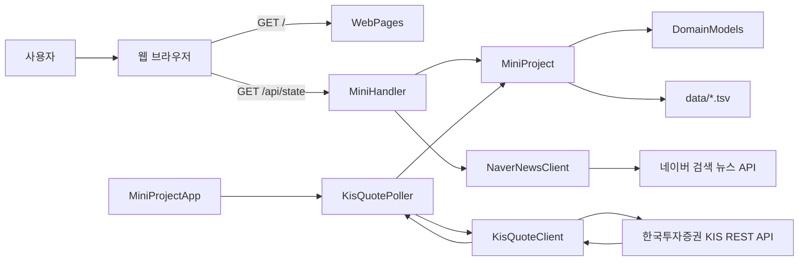
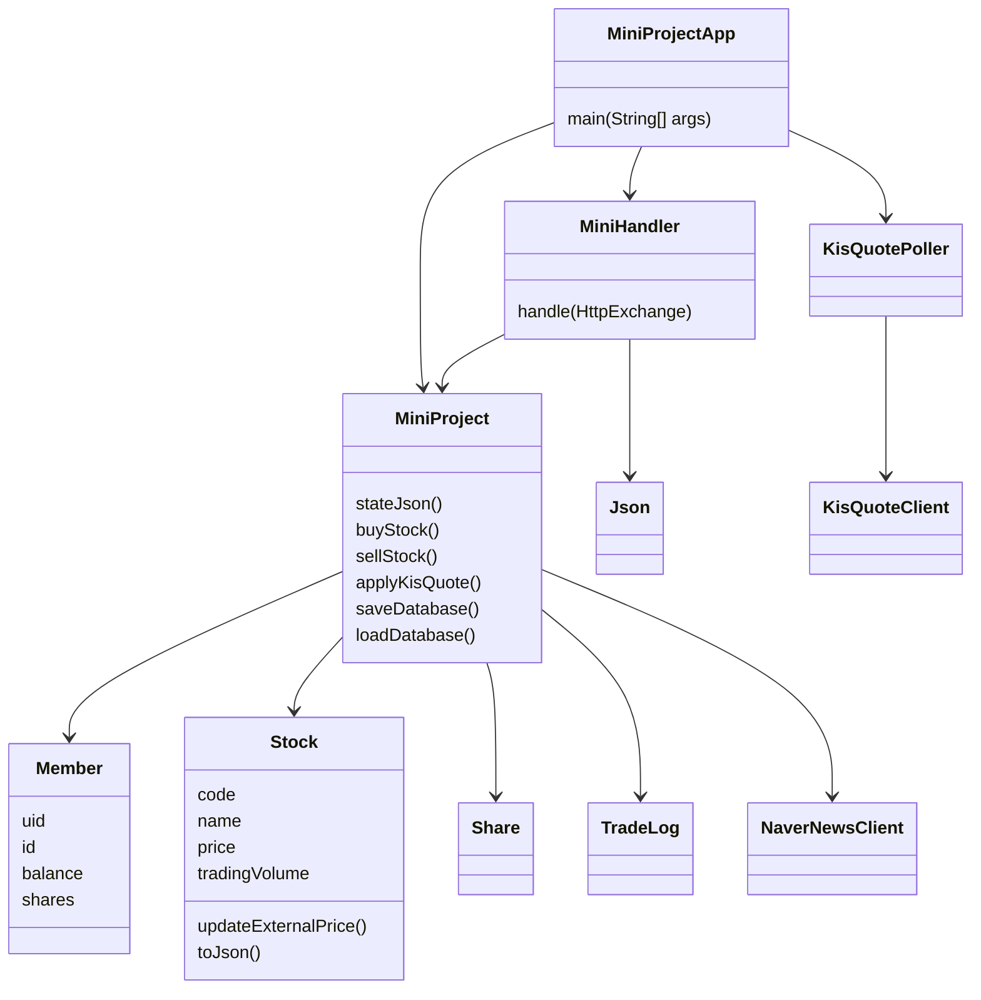
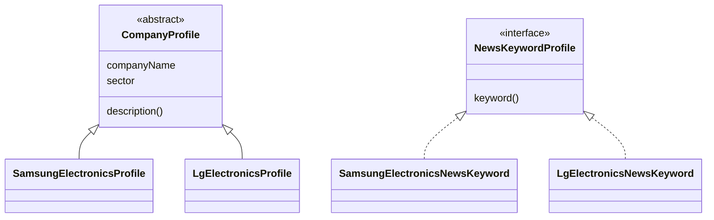
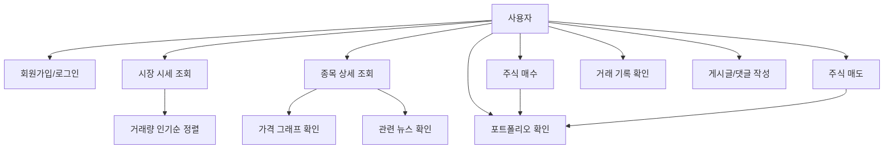

# Java 모의주식투자 웹앱 개인 프로젝트 보고서

## 1. 프로젝트 개요

본 프로젝트는 Java 표준 라이브러리 기반의 모의주식투자 웹앱이다. 사용자는 웹 브라우저에서 로그인한 뒤 국내 주식 종목을 확인하고, 원하는 수량을 입력해 매수 또는 매도할 수 있다. 프로젝트의 핵심은 한국투자증권 KIS Open API를 활용해 실제 국내주식 현재가, 전일대비, 등락률, 누적 거래량을 받아오는 것이다. 이를 통해 단순한 랜덤 가격 기반 예제보다 실제 주식 서비스에 가까운 흐름을 구현하고자 했다.

최종 구현 화면은 `http://localhost:8080/`에서 실행된다. 화면은 상단 포트폴리오 요약, 시장 시세 목록, 종목 상세, 가격 변화 그래프, 관련 뉴스, 보유 종목, 거래 기록, 게시판으로 구성된다. 시장 시세 목록은 KIS API에서 받은 누적 거래량을 기준으로 정렬되어, 사용자가 거래량이 많은 인기 종목을 먼저 확인할 수 있다.

프로젝트의 목적은 다음과 같다.

- 실제 외부 증권 API를 활용한 Java 웹 프로젝트 구현
- 사용자 매수/매도 흐름과 포트폴리오 손익 계산 구현
- 파일 저장을 통한 회원/보유/거래 기록 유지
- 쓰레드 기반 실시간 시세 갱신 구조 구현
- Java의 다양한 표준 클래스와 컬렉션 활용
- 과제 조건인 다수 클래스/인터페이스 구조와 실제 실행 가능한 웹 UI 구현

## 2. 제안발표 이후 주제 변화

초기 제안 단계에서는 Java 미니프로젝트의 기능을 웹으로 옮기고, 기본적인 회원/아이템/게시판/매매 기능을 구현하는 방향이었다. 그러나 프로젝트가 진행되면서 단순한 미니게임형 기능보다 실제 주식 데이터를 이용한 모의투자 서비스가 목적에 더 적합하다고 판단했다.

| 구분 | 제안발표 단계 | 최종 구현 |
| --- | --- | --- |
| 중심 주제 | Java 미니프로젝트 기능 구현 | KIS API 기반 모의주식투자 웹앱 |
| 가격 데이터 | 내부 샘플/모의 가격 | 한국투자증권 KIS 현재가 |
| 종목 수 | 소수 종목 | 국내 주요 종목 100개 |
| 정렬 기준 | 단순 목록 | 누적 거래량 기반 인기순 |
| 화면 | 기본 입력/출력 중심 | 종목 상세, 그래프, 뉴스, 포트폴리오 |
| 저장 | 메모리 중심 | TSV 파일 기반 저장 |
| 목적 | 기능 구현 연습 | 실제 데이터 기반 투자 흐름 구현 |

주제가 바뀐 이유는 명확하다. 모의주식투자 웹앱이라는 이름을 사용한다면, 가격이 임의로 생성되는 것보다 실제 증권 API에서 받아온 데이터가 있어야 프로젝트의 의미가 살아난다고 보았다. 그래서 한국투자증권 KIS Open API를 선택했고, 이를 중심으로 프로젝트 설명과 README도 수정했다.

## 3. 프로그램 설계

### 3.1 전체 구조

프로젝트는 별도의 Spring이나 React 없이 Java 표준 라이브러리만으로 구성했다. `HttpServer`로 웹 서버를 열고, `HttpClient`로 외부 API를 호출하며, HTML/CSS/JavaScript는 Java 문자열 템플릿에서 렌더링한다.



### 3.2 파일별 역할

| 파일 | 역할 |
| --- | --- |
| `MiniProjectApp.java` | 서버 시작점, KIS Poller 실행 |
| `MiniHandler.java` | URL별 요청 라우팅과 응답 처리 |
| `MiniProject.java` | 회원가입, 로그인, 매매, 포트폴리오, 파일 저장 |
| `DomainModels.java` | Member, Stock, Share, BoardPost, TradeLog 등 모델 |
| `KisIntegration.java` | KIS 토큰 발급, 현재가 조회, 시세 폴링 |
| `NewsIntegration.java` | 네이버 뉴스 조회, 뉴스 영향 분류 |
| `WebPages.java` | 웹 UI HTML/CSS/JavaScript 생성 |
| `Json.java` | JSON 문자열 생성과 요청 body 파싱 |
| `CompanyProfile.java` | 회사 프로필 추상 클래스, 뉴스 키워드 인터페이스 |
| `CompanyProfiles.java` | 회사 프로필 구현 클래스 |
| `NewsKeywordProfiles.java` | 종목별 뉴스 검색 키워드 클래스 |
| `BrokerIntegration.java` | 개발 테스트용 보조 시세 처리 |

### 3.3 클래스 다이어그램



### 3.4 상속과 인터페이스

프로젝트는 클래스/인터페이스 100개 이상 조건을 만족하면서도 단순히 의미 없는 클래스를 나열하지 않기 위해 회사 프로필과 뉴스 검색 키워드 구조를 분리했다.



`CompanyProfile`은 회사명과 업종이라는 공통 속성을 가진다. 따라서 추상 클래스로 만들고, 종목별 클래스가 이를 상속하게 했다. `NewsKeywordProfile`은 종목별 검색어를 제공하는 공통 규약이기 때문에 인터페이스로 분리했다. 이 설계는 상속과 인터페이스를 과제 조건에 맞게 보여주면서도 종목별 설명과 뉴스 검색어를 체계적으로 관리하는 목적을 가진다.

### 3.5 AI vs 나

| 영역 | 내가 한 결정 | AI 활용 |
| --- | --- | --- |
| 주제 방향 | 모의주식투자 웹앱으로 확정 | 기능 구현 가능성 정리 |
| 데이터 선택 | 한국투자증권 KIS Open API 사용 결정 | API 호출 구조와 Java 코드 작성 보조 |
| UI 요구 | 종목 클릭 중심, 그래프/뉴스/손익 표시 요구 | HTML/CSS/JavaScript 구현 보조 |
| 문제 발견 | 삼성전자 가격 이상, 불필요한 기능, README 문구 지적 | 원인 분석, 코드 수정, 문서 정리 |
| 품질 개선 | 종목 100개, 거래량 인기순, KIS 중심 README 요구 | 컴파일/실행 검증과 GitHub 반영 |

AI는 코드를 빠르게 작성하고 오류 원인을 좁히는 데 도움을 주었다. 하지만 프로젝트의 요구사항, 실제 화면에서 불편한 점, KIS API를 중심으로 해야 한다는 방향성, README에서 제거해야 할 문구 등은 직접 판단하고 수정 요청했다.

## 4. 데이터 흐름과 사용자 시나리오

### 4.1 사용자 시나리오

1. 사용자가 웹사이트에 접속한다.
2. 테스트 계정 또는 회원가입 계정으로 로그인한다.
3. 시장 시세 목록에서 거래량이 많은 종목을 확인한다.
4. 원하는 종목을 클릭한다.
5. 종목 코드, 업종, 현재가, 등락률, 거래량, 시세 출처, 갱신 시각을 확인한다.
6. 가격 변화 추이 그래프와 관련 뉴스를 확인한다.
7. 수량을 입력해 매수 또는 매도한다.
8. 보유 주식, 평가금액, 손익, 수익률이 갱신된다.
9. 거래 기록이 파일에 저장된다.
10. 서버를 껐다 켜도 회원/보유/거래 기록이 유지된다.

### 4.2 Use Case



### 4.3 입력, 처리, 출력

| 단계 | 내용 |
| --- | --- |
| 입력 | 로그인 정보, 매수/매도 종목, 수량, 게시글/댓글 |
| 외부 입력 | KIS 현재가, 전일대비, 등락률, 누적 거래량, 네이버 뉴스 |
| 처리 | 잔액 확인, 보유 수량 확인, 매매 체결, 손익 계산, 거래량 정렬, 뉴스 영향 분류 |
| 저장 | 회원 정보, 보유 주식, 거래 기록을 TSV 파일에 저장 |
| 출력 | 웹 화면, 시장 시세, 종목 상세, 그래프, 뉴스, 포트폴리오, 거래 기록 |

## 5. 사용자 UI / 화면

UI는 투자자가 가장 먼저 확인할 정보를 중심으로 구성했다. 초기에는 로그인/게시판/미니 기능이 섞여 있었지만, 최종적으로는 모의투자 목적이 잘 보이도록 매매와 포트폴리오 중심으로 정리했다.

### 5.1 상단 요약

상단에는 현금, 주식 평가액, 총 자산, 실시간 손익, 수익률이 표시된다. 사용자는 매수/매도 후 자신의 자산 상태가 어떻게 바뀌는지 바로 확인할 수 있다.

### 5.2 시장 시세

시장 시세는 국내 주요 종목 100개를 표시한다. 정렬 기준은 KIS API의 누적 거래량이다. 따라서 단순 가나다순이 아니라 실제 시장에서 거래가 많은 종목이 위에 오도록 했다. 이 방식은 사용자가 인기 종목을 빠르게 확인하는 데 적합하다.

### 5.3 종목 상세

종목을 클릭하면 다음 정보가 표시된다.

- 종목명
- 종목코드
- 시장
- 업종
- 현재가
- 변동폭
- 변동률
- 거래량
- 시세 출처
- 갱신 시각
- 회사 설명
- 가격 변화 추이 그래프
- 관련 뉴스

### 5.4 가격 변화 추이 그래프

`Stock` 객체는 최근 가격 히스토리를 `List<PricePoint>`로 보관한다. 화면에서는 이 데이터를 SVG 선 그래프로 그린다. 외부 차트 라이브러리를 쓰지 않고 JavaScript와 SVG만으로 구현했기 때문에 프로젝트 의존성을 줄일 수 있었다.

### 5.5 뉴스와 영향 태그

네이버 뉴스 API를 사용해 종목 관련 뉴스를 가져온다. 뉴스 제목과 설명에 포함된 키워드를 기준으로 `호재 가능`, `악재 가능`, `중립` 태그를 붙인다. 단, 이 태그는 실제 투자 판단이나 예측 모델이 아니라 키워드 기반 보조 정보다.

## 6. 한 달간의 시행착오와 문제해결

### 6.1 저장 문제

초기에는 메모리에만 데이터를 보관했다. 이 경우 서버를 재시작하면 회원, 보유 주식, 거래 기록이 모두 사라지는 문제가 있었다. 이를 해결하기 위해 `data/` 폴더에 TSV 파일을 저장하도록 구현했다.

- `data/members.tsv`: 회원 정보, 현금, 진행 날짜
- `data/shares.tsv`: 회원별 보유 종목과 수량, 매입가
- `data/trades.tsv`: 거래 기록

Java에서는 `Path`, `Files`, `ArrayList`를 사용해 파일을 읽고 썼다. 저장 메서드는 `synchronized`로 작성해 동시에 여러 요청이 들어와도 파일 저장이 꼬이지 않도록 했다.

### 6.2 인코딩 문제

프로젝트가 한글 UI와 한글 종목명을 사용하기 때문에 인코딩 문제가 자주 발생했다. PowerShell 출력에서 한글이 깨져 보이거나, Java 컴파일 시 문자열이 깨질 수 있었다. 이를 해결하기 위해 컴파일 명령에 `-encoding UTF-8`을 명시했다.

```powershell
javac -encoding UTF-8 -d out $sources
```

README와 Java 파일도 UTF-8 기준으로 관리했다.

### 6.3 KIS API 환경변수 문제

KIS Open API를 사용하려면 `KIS_APP_KEY`, `KIS_APP_SECRET`, `KIS_BASE_URL` 환경변수가 필요하다. 처음에는 실행 터미널에 키가 제대로 전달되지 않아 API가 아닌 초기 데이터처럼 보이는 문제가 있었다. 이후 PowerShell 사용자 환경변수로 설정하고 서버 실행 시 해당 환경변수를 읽도록 정리했다.

### 6.4 삼성전자 가격 문제

사용자가 삼성전자 가격이 이상하다고 지적했다. 확인 결과 KIS API 자체는 `005930`에 대한 값을 정상 반환하고 있었지만, 서버 재시작 직후 100개 종목을 순차 조회하는 과정에서 삼성전자까지 갱신되기 전 초기 샘플 가격이 잠깐 보이는 문제가 있었다.

해결 방법은 다음과 같다.

- 삼성전자, SK하이닉스, 현대차 등 주요 종목을 우선 조회하도록 순서를 변경
- KIS 조회 실패 시 3회 재시도
- 화면에 `시세 출처`와 `갱신 시각` 표시
- KIS 갱신 전이면 초기 데이터임을 사용자가 알 수 있게 표시

### 6.5 API delay와 토큰 제한

KIS API는 토큰 발급과 API 호출에 제한이 있다. 후보 종목 100개를 만들기 위해 여러 종목코드를 검증하는 과정에서 토큰 발급 제한 메시지가 발생했다. 그래서 토큰을 재사용하고, 잠시 기다린 뒤 후보 코드를 확인하는 방식으로 해결했다. 또한 `KisQuotePoller`에서 각 종목을 순차적으로 조회하고 요청 사이에 짧은 대기 시간을 두었다.

### 6.6 UI 복잡도 문제

초기에는 오늘의 운세, 주식가격예측 같은 기능이 있었다. 그러나 실제 모의주식투자 목적과 거리가 있어 삭제하거나 강조하지 않는 방향으로 바꾸었다. 최종 UI는 종목 선택, 현재가, 거래량, 그래프, 뉴스, 매매, 포트폴리오에 집중하도록 정리했다.

### 6.7 README 표현 문제

README에 “환경변수가 없으면 내부 모의 증권사 서버 사용” 같은 문구가 있었는데, 프로젝트의 핵심이 KIS Open API라면 불필요하다고 판단했다. 그래서 README를 KIS API 필수 연동 중심으로 수정했다. 이를 통해 프로젝트 목적이 더 명확해졌다.

## 7. Java 클래스와 라이브러리 활용

### 7.1 HTTP 서버

`com.sun.net.httpserver.HttpServer`를 사용해 별도 프레임워크 없이 웹 서버를 만들었다. `MiniHandler`는 요청 경로에 따라 `/`, `/api/state`, `/api/login`, `/api/stock/buy`, `/api/news` 등을 처리한다.

### 7.2 HTTP 클라이언트

`java.net.http.HttpClient`를 사용해 한국투자증권 KIS API와 네이버 뉴스 API를 호출한다. KIS 연동에서는 토큰 발급 후 현재가 API에 `authorization`, `appkey`, `appsecret`, `tr_id` 헤더를 넣어 요청한다.

### 7.3 Thread

`KisQuotePoller`는 별도 daemon thread로 동작한다. 메인 웹 서버가 사용자 요청을 처리하는 동안, Poller는 백그라운드에서 등록된 100개 종목의 현재가를 주기적으로 조회한다.

### 7.4 Collection classes

- `ConcurrentHashMap`: 회원, 종목, 보유 주식처럼 여러 요청에서 접근할 수 있는 데이터 관리
- `ArrayList`: 게시글, 댓글, 거래 기록, 가격 히스토리 관리
- `LinkedHashMap`: KIS 조회 순서와 JSON 응답 순서 유지
- `List`: 종목 목록, 우선 조회 종목, 뉴스 기사 목록 처리
- `CopyOnWriteArraySet`: 개발 테스트용 보조 시세 서버의 구독자 관리

### 7.5 File classes

`Path`와 `Files`를 사용해 TSV 파일을 저장하고 불러온다. Java 표준 라이브러리만 사용하면서도 간단한 DB처럼 동작하도록 만들었다.

### 7.6 날짜와 시간

`LocalDateTime`과 `DateTimeFormatter`를 사용해 거래 시각, 게시글 작성 시각, 가격 갱신 시각을 표시한다.

### 7.7 Atomic classes

`AtomicLong`, `AtomicInteger`를 사용해 회원 번호, 게시글 번호, 댓글 번호를 생성한다. 여러 요청이 동시에 들어와도 ID 중복 가능성을 줄일 수 있다.

## 8. 데이터 처리

### 8.1 실시간 데이터

KIS Open API에서 현재가를 조회한다. 사용하는 주요 필드는 다음과 같다.

| 필드 | 의미 |
| --- | --- |
| `stck_prpr` | 현재가 |
| `prdy_vrss` | 전일대비 |
| `prdy_ctrt` | 등락률 |
| `acml_vol` | 누적 거래량 |

### 8.2 미리 등록한 데이터

프로젝트에는 국내 주요 종목 100개가 등록되어 있다. 종목코드, 종목명, 시장, 업종, 회사 설명, 초기 가격을 seed 데이터로 두고, 실행 후 KIS API에서 받은 값으로 갱신한다.

### 8.3 뉴스 데이터

종목을 클릭하면 네이버 검색 뉴스 API로 관련 뉴스를 조회한다. 뉴스 제목과 설명에서 긍정/부정 키워드를 세어 `호재 가능`, `악재 가능`, `중립`으로 표시한다.

### 8.4 더미 데이터 여부

주식 현재가와 거래량은 KIS API를 기준으로 한다. 다만 서버 시작 직후 KIS 값이 들어오기 전에는 초기 seed 값이 잠깐 존재할 수 있다. 이를 구분하기 위해 `시세 출처`와 `갱신 시각`을 표시한다.

## 9. 주요 기능

### 9.1 회원가입/로그인

사용자는 아이디와 비밀번호로 로그인한다. 기본 테스트 계정은 `test1 / 1234`이다. 회원 정보는 `members.tsv`에 저장된다.

### 9.2 매수/매도

사용자는 종목과 수량을 선택해 매수 또는 매도한다. 매수 시 잔액이 부족하면 오류가 발생하고, 매도 시 보유 수량이 부족하면 오류가 발생한다.

### 9.3 포트폴리오 손익

보유 종목의 현재가를 기준으로 평가금액, 손익, 수익률을 계산한다. 현재가는 KIS API에서 갱신된 값을 사용한다.

### 9.4 거래 기록

매수/매도 결과는 거래 기록에 추가되고 `trades.tsv`에 저장된다. 사용자는 거래 기록 탭에서 시간, 구분, 종목, 수량, 금액을 확인할 수 있다.

### 9.5 가격 그래프

각 종목은 최근 가격 포인트를 최대 40개까지 저장한다. 웹 화면은 이 데이터를 SVG로 표시한다. 그래프는 사용자가 종목별 가격 변화 흐름을 시각적으로 확인하는 데 사용된다.

### 9.6 뉴스 조회

선택한 종목에 대한 관련 뉴스를 표시한다. 뉴스 API 키가 없으면 키 설정 안내가 표시되며, 가짜 뉴스는 생성하지 않는다.

## 10. 프로젝트 평가와 발전 방향

본 프로젝트는 Java 표준 라이브러리만으로 HTTP 서버, 외부 API 연동, 파일 저장, 쓰레드 기반 시세 갱신, 컬렉션 기반 상태 관리, 웹 UI 렌더링을 구현했다는 점에서 의미가 있다. 특히 단순 더미 데이터가 아니라 한국투자증권 KIS Open API를 기반으로 실제 주식 가격과 거래량을 반영한다는 점이 핵심이다.

향후 발전 방향은 다음과 같다.

- SQLite 또는 H2 DB 도입
- 지정가 주문과 대기 주문 자동 체결
- 최근 N일/분봉 차트 데이터 저장
- 실제 통계 기반 변동성 지표 구현
- 종목별 손익 분석
- 자산 변화 그래프
- 뉴스 키워드 분석 고도화
- UI 검색 기능과 필터 기능 추가

## 11. 발표 시 강조할 점

발표에서는 다음 세 가지를 강조하면 좋다.

첫째, 프로젝트 목적이다. 이 프로젝트는 “실제 증권 API를 연동한 모의투자 웹앱”이다. 단순히 화면을 만든 것이 아니라 사용자가 실제 현재가와 거래량을 보면서 모의 매매를 할 수 있다.

둘째, Java 활용 범위다. `HttpServer`, `HttpClient`, `Thread`, `ConcurrentHashMap`, `ArrayList`, `LinkedHashMap`, `Files`, `Path`, `LocalDateTime` 등 Java 표준 기능을 다양하게 사용했다.

셋째, 시행착오다. 저장 문제, 인코딩 문제, KIS API 키 설정, 삼성전자 가격 표시 문제, API 지연과 토큰 제한, UI 단순화, README 문구 정리 등 실제 개발 과정에서 겪은 문제를 해결했다.

## 12. 결론

최종 결과물은 Java 기반 모의주식투자 웹앱이다. 한국투자증권 KIS Open API에서 국내주식 현재가와 거래량을 받아오고, 사용자는 100개 종목 중 원하는 종목을 선택해 매수/매도할 수 있다. 보유 종목의 평가금액과 손익률은 실시간 시세를 기반으로 계산된다. 또한 종목 상세 화면에서는 가격 변화 그래프와 뉴스 정보를 함께 확인할 수 있다.

이 프로젝트를 통해 Java로 웹 서버를 직접 만들고, 외부 API를 연동하며, 파일 저장과 쓰레드 처리, 컬렉션 관리, UI 렌더링까지 구현하는 경험을 얻었다. 특히 단순한 기능 구현보다 “왜 이 데이터를 쓰는지”, “사용자가 어떤 흐름으로 투자 연습을 하는지”, “실제 문제를 어떻게 해결했는지”를 중심으로 프로젝트를 발전시켰다.
