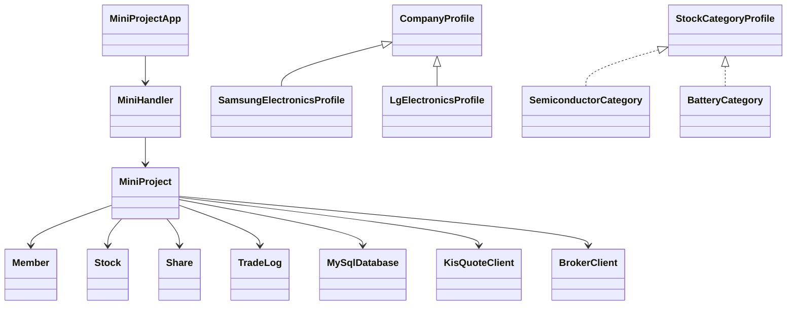

# Java 모의주식투자 웹앱 개인 프로젝트 보고서

## 1. 프로젝트 개요

이 프로젝트는 Java 표준 라이브러리 중심으로 만든 모의주식투자 웹앱이다. 사용자는 브라우저에서 로그인한 뒤 국내 주식 종목을 확인하고, 종목 상세 화면에서 현재가와 가격 변화 그래프를 본 다음 매수할 수 있다. 이미 산 종목은 보유 탭에서 수량을 지정해 매도한다.

핵심 목표는 실제 시세, 거래량, 가격 그래프, 포트폴리오 손익을 하나의 흐름으로 연결하는 것이다. 한국투자증권 KIS Open API를 이용해 국내주식 현재가와 거래량 정보를 가져오고, MySQL에 회원·보유주식·거래기록을 저장한다.

뉴스 API 기능은 최종 버전에서 제외했다. 외부 뉴스 API 키를 별도로 관리해야 하고, 종목별 기사 품질 차이가 커서 발표와 실행 안정성 측면에서 프로젝트 목적과 맞지 않는다고 판단했다.

## 2. 제안발표 이후 주제 변화

| 구분 | 제안발표 단계 | 최종 구현 |
| --- | --- | --- |
| 중심 주제 | Java 미니프로젝트 기능 구현 | KIS API 기반 모의주식투자 웹앱 |
| 가격 데이터 | 내부 샘플/모의 가격 | 한국투자증권 KIS 현재가 |
| 종목 수 | 소수 종목 | 거래량 상위 종목 중심 |
| 화면 | 기본 입력/출력 중심 | 검색, 즐겨찾기, 상세 그래프, 포트폴리오 |
| 저장 | 메모리 중심 | MySQL 테이블 기반 저장 |
| 목적 | 기능 구현 연습 | 실제 데이터 기반 투자 흐름 구현 |

## 3. 자바 기반 프로그램 설계

프로젝트는 Spring이나 React 없이 Java 표준 기능을 중심으로 구성했다. `HttpServer`로 웹 서버를 열고, `HttpClient`로 KIS API를 호출하며, HTML/CSS/JavaScript는 Java 문자열 템플릿에서 렌더링한다. 저장은 MySQL JDBC를 사용한다.

| 파일 | 역할 |
| --- | --- |
| `MiniProjectApp.java` | 서버 시작, 포트 설정, KIS/API/DB 초기화 |
| `MiniHandler.java` | URL별 HTTP 요청 라우팅과 JSON 응답 처리 |
| `MiniProject.java` | 회원가입, 로그인, 매매, 포트폴리오, 시세 상태 관리 |
| `DomainModels.java` | `Member`, `Stock`, `Share`, `TradeLog` 등 도메인 모델 |
| `DatabaseIntegration.java` | MySQL 연결, 테이블 생성, 데이터 저장/로드 |
| `KisIntegration.java` | KIS 토큰 발급, 거래량 순위, 현재가 조회, 시세 갱신 |
| `BrokerIntegration.java` | 소켓 기반 시세 구독 흐름 실험 |
| `WebPages.java` | 웹 UI HTML/CSS/JavaScript 생성 |
| `Json.java` | JSON 문자열 생성과 요청 body 파싱 |

### 3.1 클래스 다이어그램 요약



### 3.2 상속과 인터페이스

`CompanyProfile`은 회사명과 업종이라는 공통 속성을 가진다. 따라서 추상 클래스로 만들고 종목별 클래스가 이를 상속하게 했다. `StockCategoryProfile`은 업종명과 위험 설명을 제공하는 공통 규약이기 때문에 인터페이스로 분리했다.

이 구조는 클래스/인터페이스 100개 이상 조건을 맞추면서도 의미 없는 타입 나열이 되지 않도록 만든 것이다. 회사 프로필과 업종 분류를 별도 타입으로 분리해 종목 설명과 분류 체계를 코드 구조 안에 남겼다.

### 3.3 AI vs 나의 역할

| 영역 | 내가 한 결정 | AI 활용 |
| --- | --- | --- |
| 주제 방향 | 모의주식투자 웹사이트로 확정 | 구현 방식 후보 정리 |
| 데이터 선택 | 한국투자증권 KIS Open API 사용 결정 | API 호출 구조와 Java 코드 작성 보조 |
| UI 요구 | 종목 클릭 중심, 검색/즐겨찾기, 상세 매매 흐름 요구 | HTML/CSS/JS 구현 보조 |
| 문제 발견 | 가격 이상, 불필요 기능, 저장 방식, 서버 실행 문제 지적 | 원인 분석, 코드 수정, 문서 정리 |

## 4. 데이터 흐름과 사용자 시나리오

1. 웹사이트에 접속해 로그인한다.
2. 시장 시세에서 거래량 상위 종목을 확인하거나 검색한다.
3. 관심 종목을 즐겨찾기에 추가하거나 상세 화면을 연다.
4. 상세 화면에서 현재가, 등락률, 거래량, 회사 설명, 가격 그래프를 확인한다.
5. 매수 수량을 입력해 주문한다.
6. 보유 탭에서 평가금액, 손익, 수익률을 확인한다.
7. 보유 종목을 수량 지정 후 매도한다.

| 단계 | 내용 |
| --- | --- |
| 입력 | 로그인 정보, 종목 선택, 즐겨찾기, 매수/매도 수량 |
| 외부 입력 | KIS 현재가, 전일대비, 등락률, 누적 거래량 |
| 처리 | 잔액 확인, 보유 수량 확인, 매매 체결, 손익 계산 |
| 저장 | 회원 정보, 보유 주식, 거래 기록을 MySQL 테이블에 저장 |
| 출력 | 시장 시세, 종목 상세, 가격 그래프, 포트폴리오, 거래 기록 |

## 5. 사용자 UI / 화면

- 상단 요약: 보유 현금, 주식 평가액, 총자산, 실시간 손익, 수익률 표시
- 시장 시세: 거래량 상위 종목을 10개 단위 페이지로 표시
- 검색/즐겨찾기: 종목명, 코드, 업종 검색과 즐겨찾기 목록 분리
- 종목 상세: 현재가, 등락률, 거래량, 회사 설명, 가격 변화 그래프, 매수 입력
- 보유 탭: 보유 종목별 평가금액, 손익, 수익률, 매도 수량 입력
- 기록 탭: 매수/매도 시간, 종목, 수량, 금액 확인

## 6. 한 달간의 시행착오

| 문제 | 해결 |
| --- | --- |
| 저장 문제 | 서버 재시작 시 데이터가 사라지는 문제를 MySQL 저장 구조로 변경 |
| 인코딩 문제 | `javac -encoding UTF-8`, HTML 응답 charset, 문서 인코딩 정리 |
| KIS API 키 설정 | `KIS_APP_KEY`, `KIS_APP_SECRET`, `KIS_BASE_URL` 환경변수 사용 |
| 가격 표시 문제 | API 갱신 전 초기값과 실제 응답값이 섞이지 않도록 갱신 흐름 확인 |
| 종목 수 문제 | 전체 종목을 계속 갱신하지 않고 거래량 상위 종목 중심으로 제한 |
| 뉴스 기능 제외 | API 키 관리 부담과 기사 품질 편차 때문에 최종 버전에서 제거 |
| UI 복잡도 | 목적과 맞지 않는 기능을 줄이고 검색, 즐겨찾기, 상세 매매 흐름 강화 |
| 서버 실행 | VS Code 작업, PowerShell 실행 스크립트, 시작 작업 등록 스크립트 준비 |

## 7. Java 클래스 활용

| Java 기능 | 사용 내용 |
| --- | --- |
| `HttpServer` | 별도 프레임워크 없이 웹 서버 구현 |
| `HttpClient` | KIS API 호출 |
| `Thread` | 백그라운드 시세 갱신과 소켓 서버 흐름 처리 |
| `ConcurrentHashMap` | 회원, 종목, 보유 주식 상태 동시 접근 처리 |
| `ArrayList` / `List` | 거래 기록, 가격 히스토리, 종목 목록 처리 |
| `LinkedHashMap` | 조회 순서와 JSON 응답 순서 유지 |
| `JDBC DriverManager` | MySQL 연결과 SQL 실행 |
| `Files` / `Path` | 실행 스크립트와 문서 산출물 관리 |
| `LocalDateTime` | 거래 시간, 시세 갱신 시각 표시 |
| `AtomicLong` / `AtomicInteger` | 회원 번호, 로그 번호 등 식별자 생성 |

## 8. 데이터 처리

| 데이터 | 처리 방식 |
| --- | --- |
| 주식 시세 | KIS Open API 현재가 REST 조회 |
| 종목 선별 | 거래량 기준 상위 종목 중심으로 자동 갱신 |
| 실시간성 | 전체 종목 매초 조회 대신 상위 목록 중심 갱신과 소켓 구독 구조 실험 |
| 사용자 데이터 | MySQL `members`, `shares`, `trade_logs` 테이블 저장 |
| 가격 그래프 | 서버가 보관한 최근 가격 히스토리 표시 |

### 8.1 MySQL 테이블

```text
members(uid, id, password, name, balance)
shares(member_uid, stock_name, quantity, average_price)
trade_logs(id, member_uid, type, stock_name, quantity, price, created_at)
```

## 9. 소켓 서버 구조

프로젝트에는 REST API만 사용하는 구조에서 한 단계 더 나아가기 위해 모의 증권사 소켓 서버 구조도 추가했다. `BrokerIntegration`은 `ServerSocket`과 클라이언트 구독 명령을 이용해 특정 종목의 가격 Tick을 전달하는 구조다.

실제 한국투자증권 WebSocket 실시간 체결가를 완전히 대체하는 것은 아니지만, 멀티 클라이언트 구독과 실시간 전송 구조를 Java Thread 기반으로 실험했다는 점에 의미가 있다.

## 10. 실제 동작 기능

| 기능 | 현재 구현 상태 |
| --- | --- |
| 로그인/회원가입 | 테스트 계정과 신규 회원 생성 가능 |
| 시장 시세 | 거래량 상위 종목 중심 표시, 10개 단위 페이지 구성 |
| 검색 | 종목명, 코드, 업종 검색 가능 |
| 즐겨찾기 | 브라우저 localStorage 기반 관심 종목 분리 표시 |
| 종목 상세 | 현재가, 등락률, 거래량, 회사 설명, 가격 그래프 표시 |
| 매수 | 선택 종목 상세 화면에서 수량 입력 후 매수 |
| 매도 | 보유 탭에서 보유 수량 기준으로 매도 |
| 포트폴리오 | 현금, 평가금액, 총자산, 손익, 수익률 계산 |
| 거래 기록 | 매수/매도 기록을 MySQL에 저장 |

## 11. 1분 이내 시연 영상

시연 영상은 실제 코드 설명보다 사용자가 보는 화면 흐름을 보여주는 용도다. 제출용 영상은 접속, 종목 선택, 가격 그래프 확인, 매수, 보유 종목 손익 확인 장면이 들어 있다.

영상 파일 위치:

```text
deliverables/mock-stock-website-demo.webm
```

## 12. 발표 시 강조할 점

- 실제 증권 API를 붙여 모의투자 화면의 목적을 분명하게 만들었다.
- Java 표준 기능만으로 웹 서버, 외부 API, DB 저장, 쓰레드, 소켓 구조를 연결했다.
- 사용자가 불편하게 느낄 수 있는 드롭다운 주문 방식을 종목 클릭 중심 UI로 바꿨다.
- 약 2700개 전체 종목을 무리하게 갱신하지 않고 거래량 상위 종목 중심으로 현실적인 범위를 잡았다.
- 뉴스 기능은 기사 품질 편차와 API 키 관리 부담 때문에 최종 버전에서 제외했다.

## 13. 마무리와 향후 개선

최종 결과물은 Java로 직접 만든 모의주식투자 웹앱이다. 한국투자증권 KIS API로 시세와 거래량을 가져오고, MySQL에 회원·보유주식·거래기록을 저장한다. 사용자는 종목을 검색하거나 즐겨찾기하고, 상세 화면에서 가격 그래프를 확인한 뒤 매수/매도를 진행할 수 있다.

향후 개선한다면 KIS WebSocket 실시간 체결가 연동, 비밀번호 해시와 세션 보안 강화, 패키지 분리, 테스트 코드 추가, HTTPS 배포 환경 적용을 우선적으로 진행할 수 있다.
